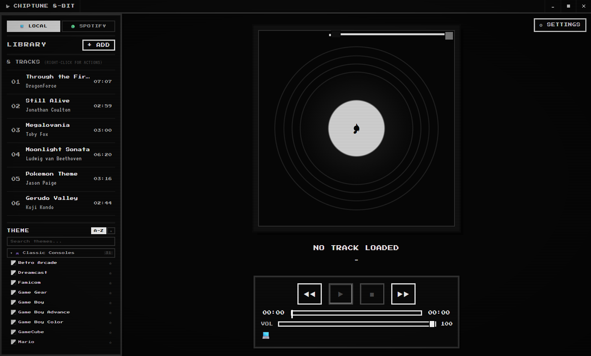
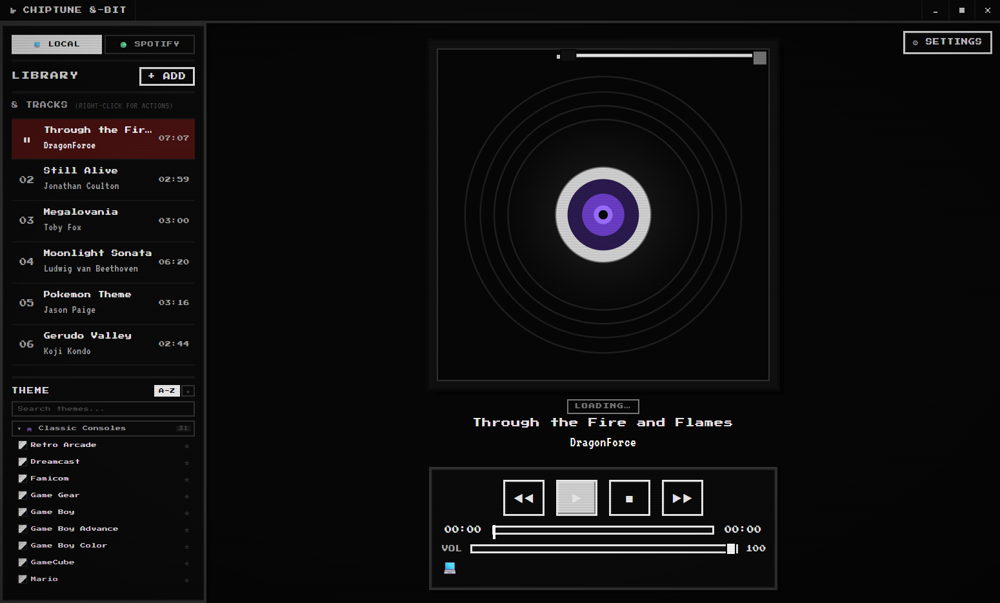
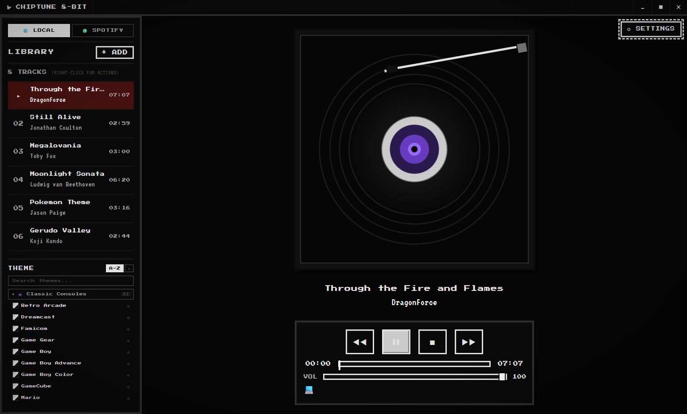
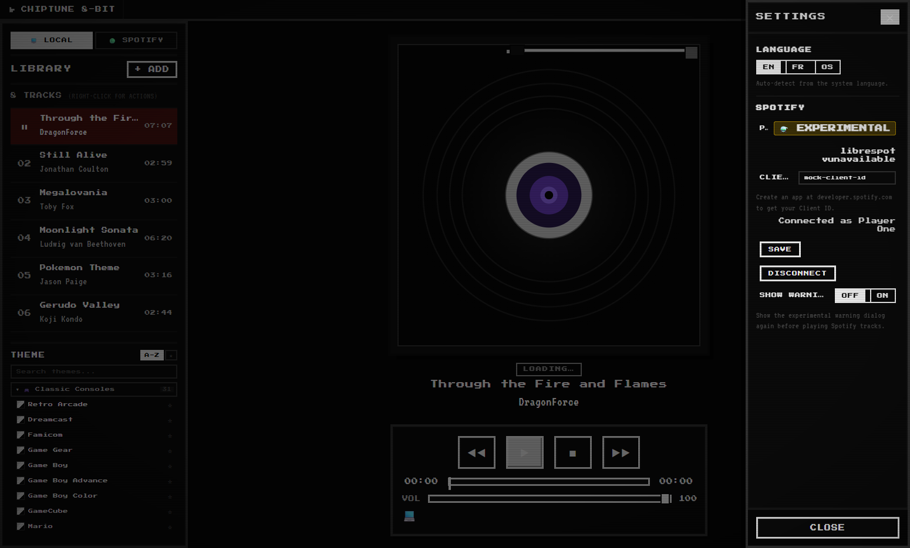
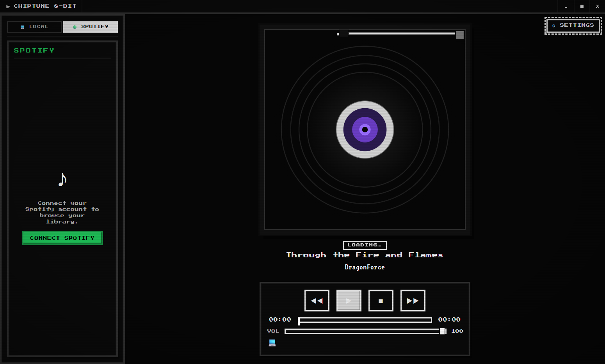
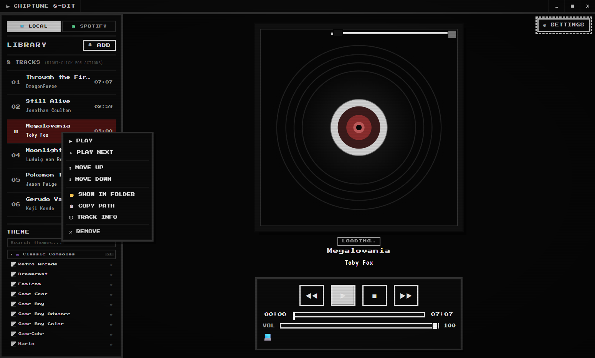
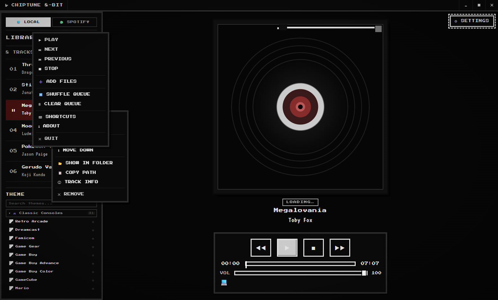

<div align="center">

<!-- Pixel-art cassette logo — scaled up from the 16×16 favicon grid -->


# 🎵 Chiptune 8-Bit Player

**v0.3.0**

A retro-inspired desktop music player with an authentic 8-bit aesthetic — bringing the look, sound, and feel of classic NES-era interfaces to your modern desktop. Powered by **Tauri 2** + **React 19**, with optional **Spotify streaming** via Librespot.

[]()
[](./LICENSE)
[](https://www.rust-lang.org/)
[](https://v2.tauri.app/)
[](https://react.dev/)
[](https://www.typescriptlang.org/)
[](https://vite.dev/)
[](https://developer.spotify.com/)
[]()

</div>

---

## ✨ Features

### 🎮 Core Experience
- **Authentic pixel-art interface** — every pixel is hand-crafted for that vintage console feel, powered by `Press Start 2P` and `VT323` fonts
- **Animated virtual vinyl record** — album artwork displayed on a stylized, spinning turntable
- **Transport controls** — Play, Pause, Stop, Previous, Next with keyboard shortcuts
- **Progress & seek bar** — click-to-seek and drag support with elapsed / remaining time display
- **Volume control** — adjustable with configurable startup level
- **Playback queue** — drag-to-reorder, shuffle, clear queue, and upcoming-track counter
- **Playback persistence** — queue and library state survive app restarts

### 🎵 Audio Support
- **Local audio files** — import via drag & drop, file picker, or right-click context menu
- **Smart metadata** — auto-detected title, artist, album, and cover art via `music-metadata`
- **Format support** — MP3, FLAC, WAV, OGG, M4A, and more (whatever your browser's Web Audio API supports)

### 🟢 Spotify Integration
- **OAuth PKCE login** — secure, no server-side secret required
- **Browse your library** — liked songs, playlists, and top tracks at your fingertips
- **Spotify search** — search tracks, albums, artists, and playlists directly
- **Dual playback engines:**
  - 🔊 **Librespot** (primary) — direct audio streaming via the open-source [librespot](https://github.com/librespot-org/librespot) library
  - 🎧 **Spotify Web Playback SDK** (fallback) — browser-based playback via Spotify's official SDK
- **Automatic tab switching** — seamlessly switches to Spotify view when connected

### 🎨 Theme System
- **70+ retro themes** organized into 6 categories:
  - 🎮 **Classic Consoles** — NES, SNES, Game Boy, Sega Genesis, PlayStation, Nintendo Switch, and more
  - 💾 **Retro Computers** — Windows 95/98/XP/7, MS-DOS, Macintosh Classic, Commodore 64, Amiga
  - 🖥️ **CRT & Terminal** — Green phosphor, Amber terminal, Matrix hacker, Monochrome
  - 🎭 **Artistic** — Vaporwave, Synthwave sunset, Tokyo Night, Dracula, Nord, Catppuccin, Cyberpunk 2077
  - 🔊 **Music & Audio** — Vinyl Studio, Cassette Player, Walkman, Hi-Fi Stereo, Boombox
  - 🌿 **Nature & Mood** — Midnight Purple, Ocean Blue, Sakura Pink, Forest Pixel, Halloween, Christmas
- **Theme search** — quickly find themes by name
- **Favorites** — bookmark your go-to themes for quick access
- **Sort modes** — sort alphabetically or by favorites
- **Smooth transitions** — animated crossfade when switching themes

### ⚙️ Settings & Customization
- **Language** — English, French, or system auto-detect (easily extensible for more locales)
- **Playback preferences** — startup volume, auto-play on import, stop behavior (pause / rewind), shuffle on import
- **Display options** — always-on-top mode, theme selection
- **Spotify configuration** — Client ID management, connection status, Librespot version info

### ⌨️ Keyboard Shortcuts

| Key | Action |
|-----|--------|
| `Space` | Play / Pause |
| `←` / `→` | Seek ±5 seconds |
| `Shift + ←` / `Shift + →` | Previous / Next track |
| `↑` / `↓` | Volume ±5% |
| `Esc` | Close dialog / menu |

### 🖱️ Context Menus
- **App-wide** (right-click anywhere) — Play/Pause, Next, Prev, Stop, Add Files, Shuffle Queue, Clear Queue, Theme selection, Shortcuts, About, Quit
- **Track-level** (right-click a track) — Play, Play Next, Move Up/Down, Show in Folder, Copy Path, Track Info, Remove (with confirmation)

### 🖼️ Interface Layout
The player is organized into four main panels:

```
┌───────────────────┬──────────────────────┐
│                   │                      │
│   Library Panel   │   Now Playing        │
│   (tracks, search,│   Sidebar            │
│    playlists)     │   (queue, upcoming)  │
│                   │                      │
├───────────────────┴──────────────────────┤
│                                           │
│    Record Player (album art + track info) │
│                                           │
├───────────────────────────────────────────┤
│    Transport Controls (seek, volume, etc) │
└───────────────────────────────────────────┘
```

---

## 📸 Screenshots

| | |
|---|---|
|  |  |
| *Main interface — Monochrome theme, library, vinyl record, and transport controls* | *Local library populated with tracks and album metadata* |
|  |  |
| *Active playback with album artwork on the vinyl record* | *Spotify search — find tracks, albums, artists, and playlists* |
|  |  |
| *Settings panel with playback, Spotify, and display options* | *70+ retro themes organized into 6 categories* |
|  |  |
| *Spotify integration — liked songs, search, and playback* | *Spotify playlists browsing with connected account* |
|  |  |
| *Right-click track context menu with playback and management options* | *About dialog with app version and credits* |

---

## 📦 Installation

### Prerequisites

- [Node.js](https://nodejs.org/) 18+
- [Rust](https://www.rust-lang.org/) (latest stable) with Cargo
- [Tauri CLI](https://v2.tauri.app/start/cli/) — `cargo install tauri-cli --version "^2"`
- For Spotify features: a [Spotify Developer](https://developer.spotify.com/) account with a registered app

### Quick Start

```bash
# Clone the repository
git clone https://github.com/ChezMarty/chiptune-8bit-player.git
cd chiptune-8bit-player

# Install frontend dependencies
npm install

# Generate favicons
npm run icons

# Launch in development mode
npm run tauri dev
```

The app window opens with the retro interface ready to go. Add audio files via the **+ADD** button or right-click → **Add Files**.

---

## 🔨 Building from Source

```bash
npm run tauri build
```

The bundled application will be available in `src-tauri/target/release/bundle/`.

### Platform Support

| Platform | Status |
|----------|--------|
| 🪟 Windows | ✅ Supported (NSIS/MSI) |
| 🍎 macOS | ✅ Supported (DMG) |
| 🐧 Linux | ✅ Supported (deb/AppImage) |

---

## 🚀 Usage

### Playing Local Music

1. Launch the app
2. **Add files** — click **+ADD**, drag & drop audio files into the window, or right-click → **Add Files**
3. **Control playback** — use the transport buttons or keyboard shortcuts (`Space` to play/pause)
4. **Manage the queue** — drag tracks to reorder, right-click for options, shuffle with the shuffle button

### Connecting Spotify

1. Register an app at the [Spotify Developer Dashboard](https://developer.spotify.com/dashboard)
2. Add `http://127.0.0.1:49436/callback` to your app's **Redirect URIs**
3. In Chiptune 8-Bit Player, click the gear icon ⚙ → navigate to the **SPOTIFY** section
4. Enter your **Client ID** and click **SAVE**
5. Click **CONNECT TO SPOTIFY** and authorize via your browser

> ⚠️ **Spotify Premium** is required for Librespot-based playback. The Spotify Web Playback SDK fallback works with any account type but needs the official Spotify client running.

---

## 🟢 Spotify Integration

Chiptune 8-Bit Player offers two Spotify playback engines:

| Engine | Requirements | Latency | Notes |
|--------|-------------|---------|-------|
| **Librespot** (default) | Spotify Premium | Low | Direct audio streaming — no client needed |
| **Web Playback SDK** (fallback) | Any Spotify account | Moderate | Requires official Spotify client running |

Both engines support:
- Full library browsing (liked songs, playlists, top tracks)
- Spotify search
- Playback controls (play, pause, skip, seek)

---

## 🎧 Listening Party

<div align="center">

> **Coming Soon** 🚧

_A real-time synchronized listening experience — share your queue and listen together with friends._

Planned features:
- Create and join listening sessions via shareable links
- Synchronized playback across multiple devices
- Shared queue management (collaborative adding, voting)
- In-app chat with 8-bit themed messages
- Role-based controls (host can pause, skip, etc.)

Stay tuned for updates!

</div>

---

## 🗺️ Roadmap

- [x] **v0.1.0** — Core player with local audio support, retro UI, basic themes
- [x] **v0.2.0** — Spotify integration (Librespot + Web SDK), 70+ themes, i18n (EN/FR)
- [x] **v0.3.0** — AudioLab DSP engine with real-time effects, spectrum visualizer, and preset system
- [ ] **v0.4.0** — Listening Party (synchronized multi-user playback)
- [ ] **v0.5.0** — Custom theme editor & community theme sharing
- [ ] **v1.0.0** — Stable release with cross-platform distribution

---

## 🛠️ Technologies Used

| Layer | Technology |
|-------|------------|
| **Frontend** | [React 19](https://react.dev/), [TypeScript](https://www.typescriptlang.org/), [Vite 7](https://vite.dev/) |
| **State Management** | [Zustand 5](https://zustand.docs.pmnd.rs/) |
| **Desktop Shell** | [Tauri 2](https://v2.tauri.app/) (Rust) |
| **Audio — Local** | HTML5 Web Audio API |
| **Audio — Spotify** | [Librespot](https://github.com/librespot-org/librespot) v0.8 / Spotify Web Playback SDK |
| **Metadata** | [music-metadata](https://github.com/Borewit/music-metadata) |
| **Styling** | CSS custom properties, pixel-art design system |
| **Typography** | [Press Start 2P](https://fonts.google.com/specimen/Press+Start+2P), [VT323](https://fonts.google.com/specimen/VT323) (Google Fonts) |
| **Persistence** | Tauri plugin-fs, OS secure credential store (keyring) |
| **Backend (Rust)** | reqwest, serde, tokio, sha2, keyring, rustls |

---

## 🤝 Contributing

Contributions are welcome! Here's how to get involved:

1. **Fork** the repository
2. **Create a feature branch** — `git checkout -b feat/amazing-feature`
3. **Commit your changes** — `git commit -m 'feat: add amazing feature'`
4. **Push to the branch** — `git push origin feat/amazing-feature`
5. **Open a Pull Request**

### Development Tips

- Run `npm run icons` after modifying the favicon grid in `scripts/gen-favicon.mjs`
- Run `cargo check` from `src-tauri/` to verify Rust code compiles
- Follow the existing code style (TypeScript strict mode, ESLint-compatible)

### Project Structure

```
chiptune-8bit-player/
├── src/                          # Frontend (React + TypeScript)
│   ├── components/               # React components
│   ├── lib/                      # Business logic
│   │   ├── playback/             # Playback engine & providers
│   │   └── ...
│   ├── state/                    # Zustand state stores
│   ├── themes/                   # Theme engine & definitions
│   ├── i18n/                     # Internationalization (en, fr)
│   ├── styles/                   # CSS style modules
│   └── ...
├── src-tauri/                    # Backend (Rust + Tauri)
│   ├── src/
│   │   ├── librespot/            # Librespot integration
│   │   ├── spotify/              # Spotify Web API (auth, API, models)
│   │   └── ...
│   └── Cargo.toml
├── scripts/                      # Build utilities
└── package.json
```

---

## 📄 License

This project is licensed under the [MIT License](./LICENSE).

### Third-Party Notices

- **[Librespot](https://github.com/librespot-org/librespot)** — open-source Spotify protocol implementation, licensed under MIT. Copyright © 2024 librespot-org. This project is **not** developed or endorsed by Spotify AB.
- **Spotify Web Playback SDK** — proprietary, used under [Spotify's Developer Terms](https://developer.spotify.com/terms).
- **Google Fonts** — [Press Start 2P](https://fonts.google.com/specimen/Press+Start+2P) (Open Font License), [VT323](https://fonts.google.com/specimen/VT323) (Open Font License).

---

<div align="center">
  <sub>Built with ❤️ and pixel-perfect precision. If you enjoy this project, consider ⭐ starring it on GitHub!</sub>
</div>
