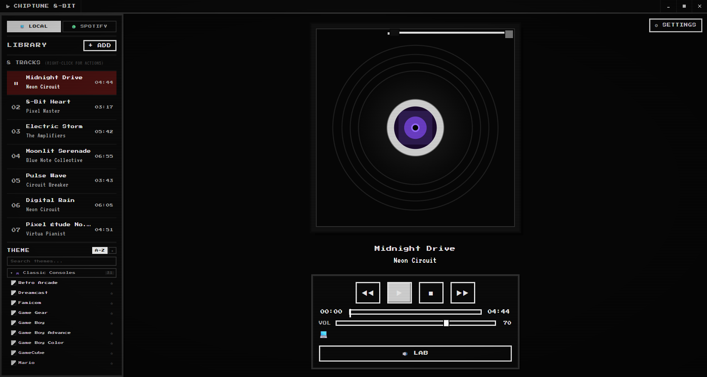
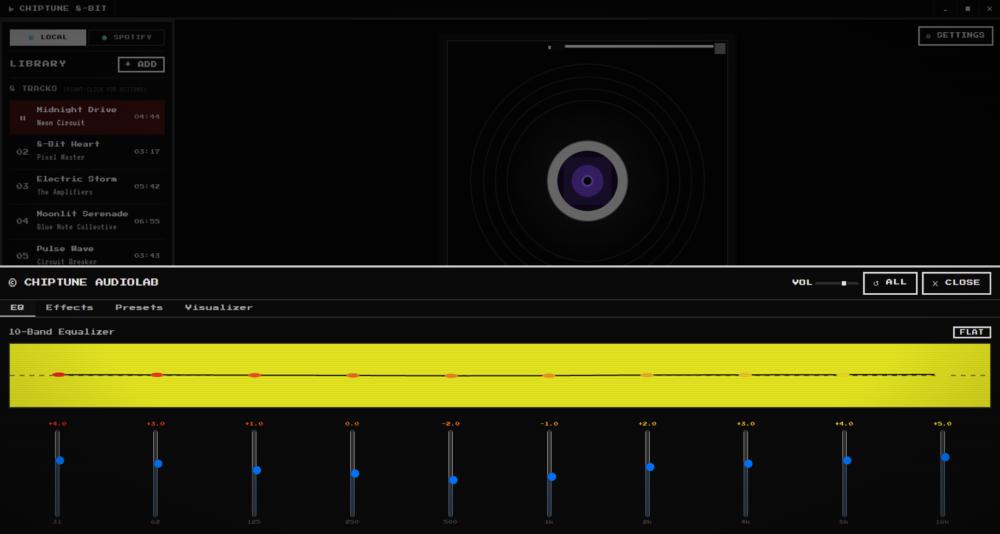
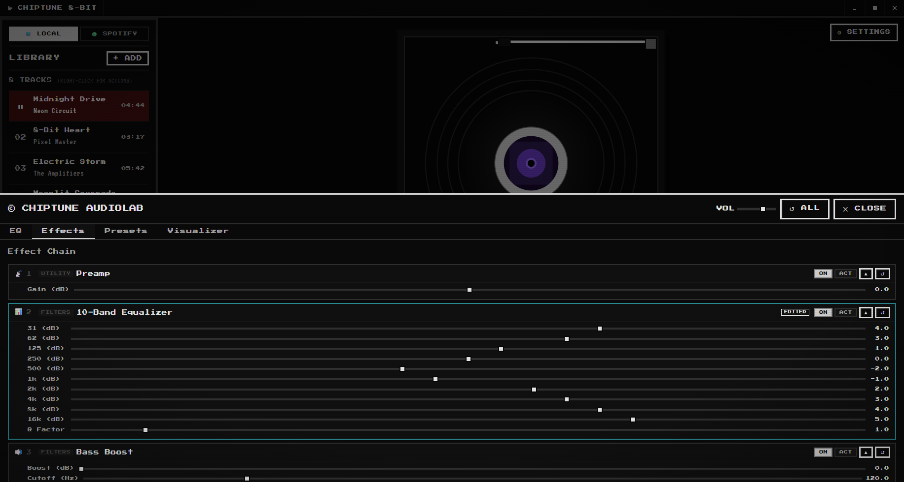
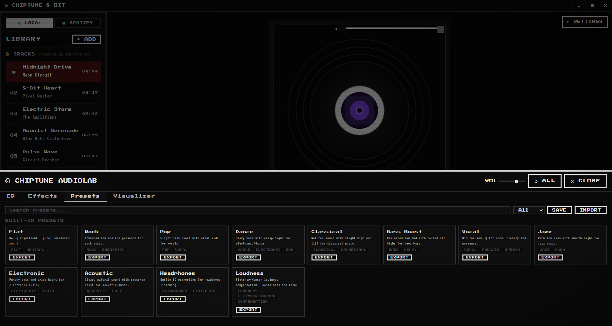
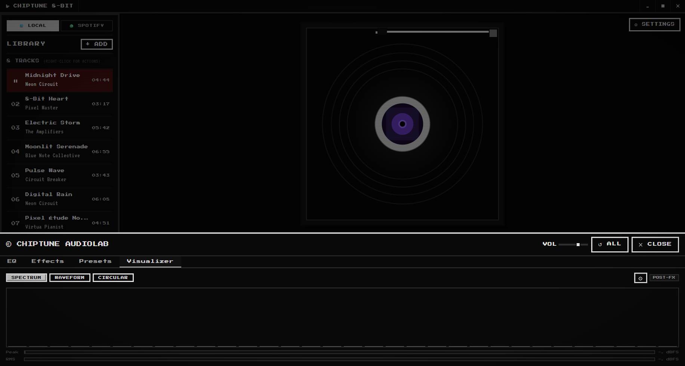
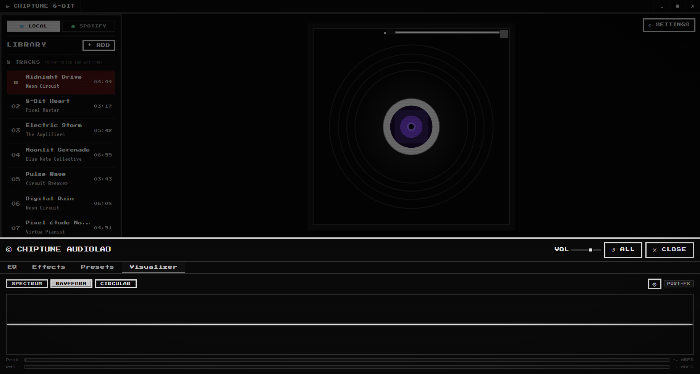
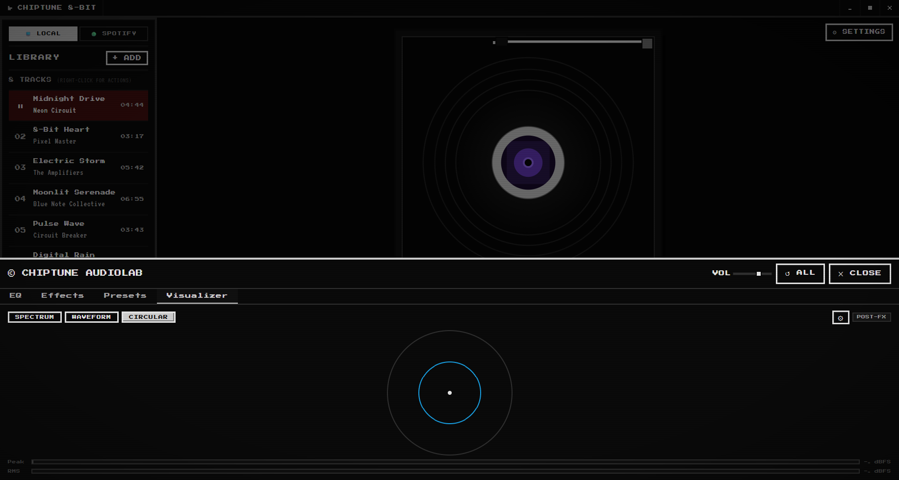
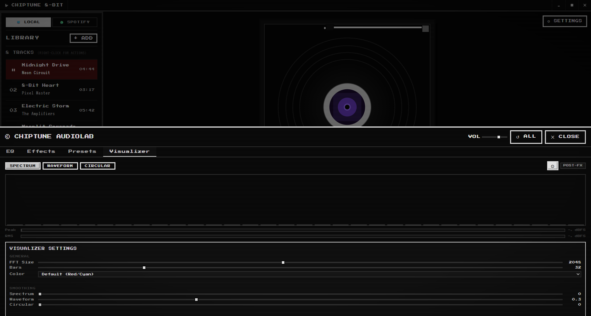
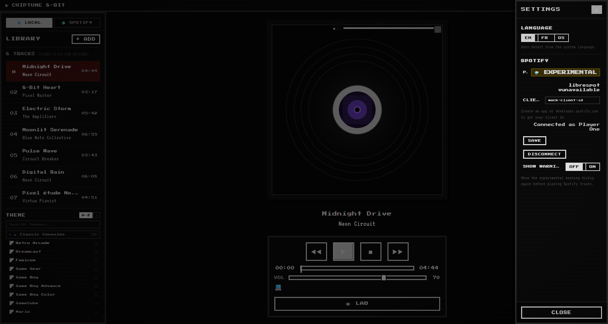

<div align="center">

<!-- Pixel-art cassette logo — scaled up from the 16×16 favicon grid -->


# 🎵 Chiptune 8-Bit Player

**v0.3.0**

A retro-inspired desktop music player with an authentic 8-bit aesthetic — bringing the look, sound, and feel of classic NES-era interfaces to your modern desktop. Now featuring the **© Chiptune AudioLab** — a complete real-time DSP engine with effects, visualizers, and presets.

[]()
[](./LICENSE)
[](https://www.rust-lang.org/)
[](https://v2.tauri.app/)
[](https://react.dev/)
[](https://www.typescriptlang.org/)
[](https://vite.dev/)
[](https://developer.spotify.com/)
[]()

</div>

---

## ✨ Features at a Glance

| Category | Highlights |
|----------|-----------|
| 🎮 **Core Player** | Pixel-art interface, virtual vinyl record, transport controls, playback queue, drag-to-reorder |
| 🔊 **AudioLab DSP** | Real-time effects engine with 7 processing modules (see below) |
| 📊 **Visualizer** | Spectrum analyzer, waveform, circular visualizer with peak/RMS metering |
| 🎛️ **Presets** | 12 built-in presets, custom presets, save/rename/duplicate, import/export |
| 🟢 **Spotify** | OAuth PKCE login, Librespot + Web Playback SDK, library browsing |
| 🎨 **Themes** | 70+ retro themes in 6 categories, search, favorites, smooth transitions |
| 🌐 **i18n** | English, French, or OS auto-detect |

---

## 🎛️ © Chiptune AudioLab

The marquee feature of **v0.3.0** — a complete real-time digital signal processing pipeline integrated directly into the player.

### Real-Time DSP Engine

Seven processing modules arranged in a carefully ordered chain, each affecting the audio signal before it reaches your ears:

| Module | Description |
|--------|-------------|
| **Preamp** | Input gain stage — boost or cut the signal level before any other processing |
| **10-Band Equalizer** | Graphic EQ covering 31 Hz to 16 kHz with independent gain per band (±12 dB) |
| **Bass Boost** | Low-frequency enhancer with adjustable cutoff frequency |
| **Treble Boost** | High-frequency enhancer with adjustable cutoff frequency |
| **Balance** | Stereo pan control (left/right) |
| **Stereo Width** | Mid/side stereo field processor — widen or narrow the stereo image |
| **Master Volume** | Final output level control |

Each effect can be individually **enabled**, **bypassed**, or **reset to default** — all in real time without interrupting playback.

### Visualizer System

Three display modes with real-time POST-FX analysis (signal analyzed after all DSP processing):

| Mode | Description |
|------|-------------|
| 📊 **Spectrum Analyzer** | Frequency-domain bar visualization with configurable bar count and sensitivity |
| 〰️ **Waveform** | Time-domain waveform display with EMA smoothing |
| 🔵 **Circular Spectrum** | Radial frequency visualization — bars arranged in a circle |

All modes include:

- **Peak Meter** — real-time peak level with dBFS readout
- **RMS Meter** — average signal level with dBFS readout  
- **Clip Indicator** — visual badge when signal approaches 0 dBFS
- **EMA Smoothing** — per-mode smoothing factor for fluid animation
- **Configurable FFT Size** (256–4096), bar count (8–128), and sensitivity (0.1×–5×)
- **Color Themes** — 8 color presets (Red, Cyan, Green, Amber, Purple, Pink, Blue) or auto-match the app theme
- **Peak Hold** — configurable hold duration (0–5000 ms) and decay rate
- **Pre/Post FX Toggle** — switch analyzer source between pre-DSP and post-DSP signal

### Preset System

Save, load, and share your DSP configurations:

| Feature | Description |
|---------|-------------|
| **Built-in Presets** | 12 factory presets: Flat, Rock, Pop, Dance, Classical, Bass Boost, Vocal, Jazz, Electronic, Acoustic, Headphones, Loudness |
| **Custom Presets** | Save your own configurations with custom names and descriptions |
| **Rename** | Rename any user preset |
| **Duplicate** | Clone an existing preset as a starting point |
| **Delete** | Remove user presets you no longer need |
| **Import** | Load presets from `.json` files via the native file picker |
| **Export** | Share presets as `.json` files |
| **Auto-Persistence** | All user presets stored in the app data directory, survive restarts |
| **Last Preset Restore** | The last active preset is automatically restored on next launch |

### Audio Sources

The AudioLab works with **all** playback sources through the same real-time DSP pipeline:

- **Local audio files** (MP3, FLAC, WAV, OGG, M4A, and more)
- **Spotify playback** (both Librespot and Web Playback SDK engines)

### Architecture

```
Audio Source (Local / Spotify)
      │
      ▼
   Input Node
      │
      ▼
   ┌─ Preamp ───────────────────────┐
   │  Input gain boost/cut           │
   └──────────────┬──────────────────┘
                  ▼
   ┌─ 10-Band Equalizer ────────────┐
   │  31 Hz – 16 kHz graphic EQ     │
   └──────────────┬──────────────────┘
                  ▼
   ┌─ Bass Boost ───────────────────┐
   │  Low-shelf filter              │
   └──────────────┬──────────────────┘
                  ▼
   ┌─ Treble Boost ─────────────────┐
   │  High-shelf filter             │
   └──────────────┬──────────────────┘
                  ▼
   ┌─ Balance ──────────────────────┐
   │  Stereo pan (L/R)              │
   └──────────────┬──────────────────┘
                  ▼
   ┌─ Stereo Width ─────────────────┐
   │  Mid/Side processing           │
   └──────────────┬──────────────────┘
                  ▼
   ┌─ Master Volume ────────────────┐
   │  Final output level            │
   └──────┬─────────────────────────┘
          │
          ├──► Audio Output (speakers/headphones)
          │
          └──► AnalyzerService
                   ├── Spectrum (frequency domain)
                   ├── Waveform (time domain)
                   ├── Circular Spectrum
                   ├── Peak Meter
                   └── RMS Meter + Clip Indicator
```

---

## 🎮 Core Experience

- **Authentic pixel-art interface** — every pixel hand-crafted for that vintage console feel, powered by `Press Start 2P` and `VT323` fonts
- **Animated virtual vinyl record** — album artwork displayed on a stylized, spinning turntable
- **Transport controls** — Play, Pause, Stop, Previous, Next with keyboard shortcuts
- **Progress & seek bar** — click-to-seek and drag support with elapsed / remaining time display
- **Volume control** — adjustable with configurable startup level
- **Playback queue** — drag-to-reorder, shuffle, clear queue, and upcoming-track counter
- **Playback persistence** — queue and library state survive app restarts
- **Context menus** — app-wide and track-level right-click menus with rich actions

---

## 🟢 Spotify Integration

| Feature | Details |
|---------|---------|
| **Authentication** | OAuth PKCE login — secure, no server-side secret required |
| **Library Browsing** | Liked songs, playlists, and top tracks at your fingertips |
| **Search** | Search tracks, albums, artists, and playlists directly |
| **Dual Playback Engines** | 🔊 **Librespot** (primary) — direct audio streaming via open-source library · 🎧 **Spotify Web Playback SDK** (fallback) — browser-based playback |
| **Auto Switching** | Seamlessly switches to Spotify view when connected |

---

## 🎨 Theme System

**70+ retro themes** organized into 6 categories:

| Category | Examples |
|----------|----------|
| 🎮 **Classic Consoles** | NES, SNES, Game Boy, Sega Genesis, PlayStation, Nintendo Switch, and more |
| 💾 **Retro Computers** | Windows 95/98/XP/7, MS-DOS, Macintosh Classic, Commodore 64, Amiga |
| 🖥️ **CRT & Terminal** | Green phosphor, Amber terminal, Matrix hacker, Monochrome |
| 🎭 **Artistic** | Vaporwave, Synthwave sunset, Tokyo Night, Dracula, Nord, Catppuccin, Cyberpunk 2077 |
| 🔊 **Music & Audio** | Vinyl Studio, Cassette Player, Walkman, Hi-Fi Stereo, Boombox |
| 🌿 **Nature & Mood** | Midnight Purple, Ocean Blue, Sakura Pink, Forest Pixel, Halloween, Christmas |

- **Theme search** — quickly find themes by name
- **Favorites** — bookmark your go-to themes for quick access
- **Sort modes** — sort alphabetically or by favorites
- **Smooth transitions** — animated crossfade when switching themes

---

## ⌨️ Keyboard Shortcuts

| Key | Action |
|-----|--------|
| `Space` | Play / Pause |
| `←` / `→` | Seek ±5 seconds |
| `Shift + ←` / `Shift + →` | Previous / Next track |
| `↑` / `↓` | Volume ±5% |
| `Esc` | Close dialog / menu |

---

## 📸 Screenshots

All screenshots captured with the **Monochrome** theme in **English** locale at 1833×980 resolution.

| | |
|---|---|
|  |  |
| *Main player interface with record vinyl, library panel, and transport controls* | *Local library with populated tracks and album artwork on the vinyl record* |
|  |  |
| *Spotify playlists browser with connected account* | *10-band graphic equalizer with adjusted frequency curve* |
|  |  |
| *Effects tab showing all 7 DSP modules with expanded parameters* | *Preset browser with built-in and custom presets* |
|  |  |
| *Spectrum analyzer mode with peak and RMS metering* | *Waveform display mode with real-time audio visualization* |
|  |  |
| *Circular spectrum visualization in radial layout* | *Visualizer settings panel with smoothing, sensitivity, and metering controls* |
|  | |
| *Settings drawer with playback, Spotify, and display options* | |

---

## 📦 Installation

### Prerequisites

- [Node.js](https://nodejs.org/) 18+
- [Rust](https://www.rust-lang.org/) (latest stable) with Cargo
- [Tauri CLI](https://v2.tauri.app/start/cli/) — `cargo install tauri-cli --version "^2"`
- For Spotify features: a [Spotify Developer](https://developer.spotify.com/) account with a registered app

### Quick Start

```bash
# Clone the repository
git clone https://github.com/ChezMarty/chiptune-8bit-player.git
cd chiptune-8bit-player

# Install frontend dependencies
npm install

# Generate favicons
npm run icons

# Launch in development mode
npm run tauri dev
```

The app window opens with the retro interface ready to go. Add audio files via the **+ADD** button, drag & drop, or right-click → **Add Files**. Open the **AudioLab** panel from the toolbar to start shaping your sound.

---

## 🔨 Building from Source

```bash
npm run tauri build
```

The bundled application will be available in `src-tauri/target/release/bundle/`.

### Platform Support

| Platform | Status |
|----------|--------|
| 🪟 Windows | ✅ Supported (NSIS/MSI) |
| 🍎 macOS | ✅ Supported (DMG) |
| 🐧 Linux | ✅ Supported (deb/AppImage) |

---

## 🚀 Usage

### Playing Local Music

1. Launch the app
2. **Add files** — click **+ADD**, drag & drop audio files into the window, or right-click → **Add Files**
3. **Control playback** — use the transport buttons or keyboard shortcuts (`Space` to play/pause)
4. **Manage the queue** — drag tracks to reorder, right-click for options, shuffle with the shuffle button

### Using the AudioLab

1. Click the **AudioLab** button in the toolbar or access it from the context menu
2. Navigate between **EQ**, **Effects**, **Presets**, and **Visualizer** tabs
3. **EQ Tab** — adjust each of the 10 frequency bands by dragging the sliders
4. **Effects Tab** — enable/disable/bypass individual effects and tweak their parameters
5. **Presets Tab** — browse built-in presets, save your own, import/export preset files
6. **Visualizer Tab** — switch between spectrum, waveform, and circular modes. Configure smoothing, sensitivity, bar count, and color from the settings panel (⚙ button)
7. Use the **Master Volume** slider in the AudioLab header for quick level adjustment
8. Click **↺ ALL** to reset all effects to their default state

### Connecting Spotify

1. Register an app at the [Spotify Developer Dashboard](https://developer.spotify.com/dashboard)
2. Add `http://127.0.0.1:49436/callback` to your app's **Redirect URIs**
3. In Chiptune 8-Bit Player, click the gear icon ⚙ → navigate to the **SPOTIFY** section
4. Enter your **Client ID** and click **SAVE**
5. Click **CONNECT TO SPOTIFY** and authorize via your browser

> ⚠️ **Spotify Premium** is required for Librespot-based playback. The Spotify Web Playback SDK fallback works with any account type but needs the official Spotify client running.

---

## 🟢 Spotify Integration Details

Chiptune 8-Bit Player offers two Spotify playback engines:

| Engine | Requirements | Latency | Notes |
|--------|-------------|---------|-------|
| **Librespot** (default) | Spotify Premium | Low | Direct audio streaming — no client needed |
| **Web Playback SDK** (fallback) | Any Spotify account | Moderate | Requires official Spotify client running |

Both engines support:
- Full library browsing (liked songs, playlists, top tracks)
- Spotify search
- Playback controls (play, pause, skip, seek)

Both engines route audio through the **AudioLab DSP pipeline**, so effects and visualizers work with Spotify content just as they do with local files.

---

## ⚙️ Settings & Customization

- **Language** — English, French, or system auto-detect (easily extensible for more locales)
- **Playback preferences** — startup volume, auto-play on import, stop behavior (pause / rewind), shuffle on import
- **Display options** — always-on-top mode, theme selection
- **Visualizer defaults** — FFT size, bar count, smoothing, sensitivity, metering preferences
- **Spotify configuration** — Client ID management, connection status, Librespot version info

---

## 🎧 Listening Party

<div align="center">

> **Coming Soon** 🚧

_A real-time synchronized listening experience — share your queue and listen together with friends._

Planned features:
- Create and join listening sessions via shareable links
- Synchronized playback across multiple devices
- Shared queue management (collaborative adding, voting)
- In-app chat with 8-bit themed messages
- Role-based controls (host can pause, skip, etc.)

Stay tuned for updates!

</div>

---

## 🗺️ Roadmap

- [x] **v0.1.0** — Core player with local audio support, retro UI, basic themes
- [x] **v0.2.0** — Spotify integration (Librespot + Web SDK), 70+ themes, i18n (EN/FR)
- [x] **v0.3.0** — AudioLab DSP engine with real-time effects, spectrum visualizer, and preset system
- [ ] **v0.4.0** — Listening Party (synchronized multi-user playback)
- [ ] **v0.5.0** — Custom theme editor & community theme sharing
- [ ] **v1.0.0** — Stable release with cross-platform distribution

---

## 🛠️ Technologies Used

| Layer | Technology |
|-------|-----------|
| **Frontend** | [React 19](https://react.dev/), [TypeScript](https://www.typescriptlang.org/), [Vite 7](https://vite.dev/) |
| **State Management** | [Zustand 5](https://zustand.docs.pmnd.rs/) |
| **Desktop Shell** | [Tauri 2](https://v2.tauri.app/) (Rust) |
| **Audio — Local** | HTML5 Web Audio API |
| **Audio — DSP** | Custom real-time DSP pipeline with Web Audio API AudioNodes |
| **Audio — Spotify** | [Librespot](https://github.com/librespot-org/librespot) v0.8 / Spotify Web Playback SDK |
| **Metadata** | [music-metadata](https://github.com/Borewit/music-metadata) |
| **Styling** | CSS custom properties, pixel-art design system |
| **Typography** | [Press Start 2P](https://fonts.google.com/specimen/Press+Start+2P), [VT323](https://fonts.google.com/specimen/VT323) (Google Fonts) |
| **Persistence** | Tauri plugin-fs, OS secure credential store (keyring) |
| **Backend (Rust)** | reqwest, serde, tokio, sha2, keyring, rustls |

---

## 🤝 Contributing

Contributions are welcome! Here's how to get involved:

1. **Fork** the repository
2. **Create a feature branch** — `git checkout -b feat/amazing-feature`
3. **Commit your changes** — `git commit -m 'feat: add amazing feature'`
4. **Push to the branch** — `git push origin feat/amazing-feature`
5. **Open a Pull Request**

### Development Tips

- Run `npm run icons` after modifying the favicon grid in `scripts/gen-favicon.mjs`
- Run `cargo check` from `src-tauri/` to verify Rust code compiles
- Follow the existing code style (TypeScript strict mode, ESLint-compatible)

### Project Structure

```
chiptune-8bit-player/
├── src/                          # Frontend (React + TypeScript)
│   ├── components/               # React components
│   │   ├── AudioLab/             # AudioLab panel, tabs, visualizers
│   │   └── ...
│   ├── dsp/                      # Digital Signal Processing engine
│   │   ├── analyzers/            # AnalyzerService for visualization data
│   │   ├── effects/              # Individual DSP effect modules
│   │   ├── presets/              # Preset manager & built-in presets
│   │   └── ...
│   ├── lib/                      # Business logic
│   │   └── playback/             # Playback engine & providers
│   ├── state/                    # Zustand state stores
│   ├── themes/                   # Theme engine & definitions
│   ├── i18n/                     # Internationalization (en, fr)
│   └── styles/                   # CSS style modules
├── src-tauri/                    # Backend (Rust + Tauri)
│   ├── src/
│   │   ├── librespot/            # Librespot integration
│   │   ├── spotify/              # Spotify Web API (auth, API, models)
│   │   └── ...
│   └── Cargo.toml
├── scripts/                      # Build utilities
└── package.json
```

---

## 📄 License

This project is licensed under the [MIT License](./LICENSE).

### Third-Party Notices

- **[Librespot](https://github.com/librespot-org/librespot)** — open-source Spotify protocol implementation, licensed under MIT. Copyright © 2024 librespot-org. This project is **not** developed or endorsed by Spotify AB.
- **Spotify Web Playback SDK** — proprietary, used under [Spotify's Developer Terms](https://developer.spotify.com/terms).
- **Google Fonts** — [Press Start 2P](https://fonts.google.com/specimen/Press+Start+2P) (Open Font License), [VT323](https://fonts.google.com/specimen/VT323) (Open Font License).

---

<div align="center">
  <sub>Built with ❤️ and pixel-perfect precision. If you enjoy this project, consider ⭐ starring it on GitHub!</sub>
</div>
